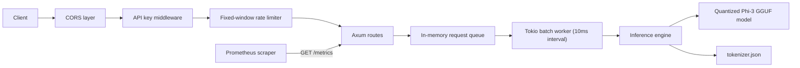

# LLM Inference Server

`llm-inference-server` is a Rust HTTP service that loads a local GGUF model through Candle's quantized Phi-3 path and exposes OpenAI-style `/v1/completions` and `/v1/chat/completions` endpoints. The implementation is intentionally small: Axum handles the API surface, a Tokio task drains an in-memory request queue every 10ms, and generation runs inside a single-process inference engine with Prometheus metrics, API-key auth, rate limiting, and CORS.

## Features

- Local GGUF model loading at startup with Metal GPU fallback to CPU
- OpenAI-compatible `POST /v1/completions` and `POST /v1/chat/completions` endpoints
- Async request batching queue with a fixed `10ms` drain cadence and `max_batch_size` cap
- Temperature and top-p sampling, plus greedy decoding when `temperature <= 0`
- Bearer-token API-key middleware, enabled unless `DEV_MODE=true`
- Fixed-window in-memory rate limiting via `RATE_LIMIT_RPS`
- Configurable CORS allowlist
- Prometheus metrics exported from `/metrics`

## Stack

Rust, Axum, Tokio, candle-core / candle-transformers (Hugging Face Candle), Prometheus, tower-http

## Architecture



## Getting started

### Requirements

- Rust 1.70+ (edition 2021)
- A local GGUF model file compatible with Candle's quantized Phi-3 loader
- `tokenizer.json` in the same directory as the model file
- Apple Silicon is optional; if Metal is unavailable, the server falls back to CPU

### Build

```bash
cargo build --release
```

### Run

Set either `DEV_MODE=true` for local development or provide an API key with `LLM_API_KEY`.

```bash
DEV_MODE=true ./target/release/llm-inference-server \
  --model /path/to/model.gguf \
  --port 8000 \
  --max-batch-size 32 \
  --max-seq-len 4096
```

### CLI flags

- `--model <path>`: required model path
- `--port <number>`: server port, default `8000`
- `--max-batch-size <number>`: queue drain cap per tick, default `32`
- `--max-seq-len <number>`: maximum sequence length, default `4096`
- `--verbose`: enables debug logging

### Environment variables

- `DEV_MODE=true|false`: bypasses API-key checks when true
- `LLM_API_KEY=<token>`: required unless `DEV_MODE=true`
- `CORS_ALLOWED_ORIGINS=http://localhost:3000,...`: comma-separated allowlist
- `RATE_LIMIT_RPS=<positive integer>`: fixed-window request limit, default `60`

## API reference

### Health check

```bash
curl http://localhost:8000/health
```

Response:

```json
{
  "status": "healthy"
}
```

### Chat completions

```bash
curl http://localhost:8000/v1/chat/completions \
  -H "Content-Type: application/json" \
  -d '{
    "model": "local-model",
    "messages": [
      {"role": "user", "content": "Hello, how are you?"}
    ],
    "max_tokens": 100,
    "temperature": 0.7,
    "top_p": 0.9
  }'
```

### Completions

```bash
curl http://localhost:8000/v1/completions \
  -H "Content-Type: application/json" \
  -d '{
    "model": "local-model",
    "prompt": "The capital of France is",
    "max_tokens": 50,
    "temperature": 0.7,
    "top_p": 0.9
  }'
```

### Metrics

```bash
curl http://localhost:8000/metrics
```

Registered metrics:

- `tokens_per_second`
- `request_latency_seconds`
- `queue_depth`
- `gpu_utilization_percent`
- `requests_total`
- `tokens_generated_total`

### Benchmarking

Run benchmarking commands on your hardware and model to measure actual throughput and latency:

```bash
ab -n 100 -c 8 -p request.json -T application/json http://127.0.0.1:8000/v1/completions
```

Example `request.json`:

```json
{
  "model": "local-model",
  "prompt": "Hello",
  "max_tokens": 32,
  "temperature": 0.0,
  "top_p": 1.0
}
```

## Tests

Current `cargo test` summary:

```text
running 9 tests
test result: ok. 9 passed; 0 failed; 0 ignored; 0 measured; 0 filtered out
```

The tests cover:

- `/health` and `/metrics` endpoint wiring
- `/v1/completions` success and over-limit prompt rejection paths
- bearer-token parsing
- timestamp generation
- top-p filtering and argmax sampling helpers

## Design decisions

Rust keeps the server runtime small and gives explicit control over concurrency, ownership, and failure handling around model execution. The batching mechanism is a fixed-cadence queue rather than dynamic in-flight batching: it is simpler to reason about, but it adds queueing delay and does not merge partially completed sequences. Rate limiting is implemented as a process-local fixed window because it is easy to audit and has no external dependency, at the cost of rougher boundaries than a token bucket. The server is intentionally single-process and in-memory, which keeps the code legible for a portfolio review but means scaling and multi-tenant concerns are left to a future architecture.

## License

MIT
